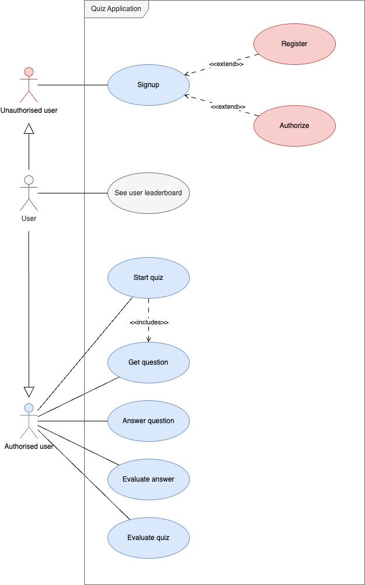

# Business Assignment - Quiz Demo

## Executive Summary

### Solution Overview
The Quiz Mobile Application is a dynamic, interactive platform designed to engage users in quizzes across various topics.

It aims to provide an educational and entertaining experience, with an optional web component for viewing leaderboards.

### Objectives
- To create an engaging and interactive quiz experience for users.
- To provide a competitive platform with a leaderboard to encourage user retention.

### Scope
The scope includes the development of a mobile application with signup, quiz participation, and result-viewing functionalities.

An optional web application will display global leaderboards.

### Assumptions and Constraints

#### Assumptions
- **User Base**: It is assumed that the primary users will be familiar with mobile applications and quizzes.
- **Internet Connectivity**: Users are assumed to have consistent access to the internet to use the application.
- **Device Compatibility**: The application is designed for modern iOS and Android devices, assuming users will have devices updated to at least two versions behind the current operating system.

#### Constraints
- **Development Timeframe**: The project has a fixed timeline of 3 weeks from inception to launch.
- **Budget**: The budget is limited, restricting the extent of features and third-party services that can be integrated.
- **Technical**: The application must operate efficiently across various devices, including older models with limited processing power and storage.

### Target Audience
The primary target audience includes students and individuals looking for educational entertainment.

## Business Requirements

### Problem Statement
Users seek engaging ways to learn and test their knowledge on various subjects.

### Business Objectives
Increase user engagement and retention.
Provide an educational tool for a wide range of topics.

### Stakeholders
Target Users - Individuals seeking to learn through interactive quizzes.

### Functional Requirements
- **User Authentication and Registration**: Allow users to sign up and log in to the application, capturing essential information such as name and email.
- **Quiz Participation**: Users should be able to choose from a variety of quizzes, answer questions, and receive immediate feedback.
- **Results and Feedback**: Provide users with their quiz results and correct answers.
- **Leaderboard Integration (Web Application)**: Display top scores and rankings on a web-based leaderboard to foster a competitive environment.

Source: [Quiz Use-Case Diagram](assets/quiz-use_cases.drawio)

### Non-Functional Requirements
- **Scalability**: The application should be scalable to accommodate a growing number of users.
- **Responsiveness**: Ensure a seamless user experience across different devices and screen sizes.
- **Security**: Implement robust security measures to protect user data and privacy.