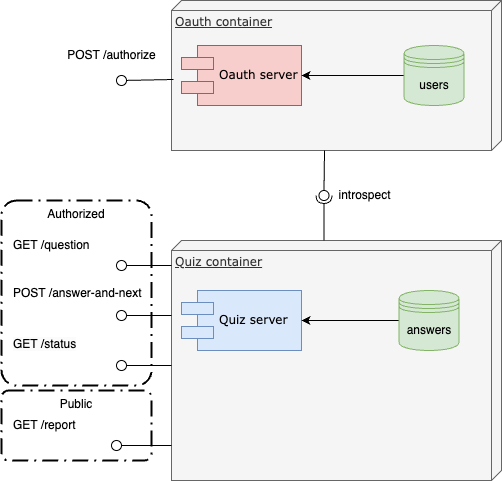

# Solution Architecture

## Overview
The application will follow a client-server model, with the mobile app as the client and a backend server handling data processing and storage.

Data encryption, secure API access, and user authentication measures will be implemented to protect user data and privacy.

## High-Level Architecture Diagram

Source: [Architecture as Component Diagram](assets/quiz_backend-component_diagram-simplified.drawio)