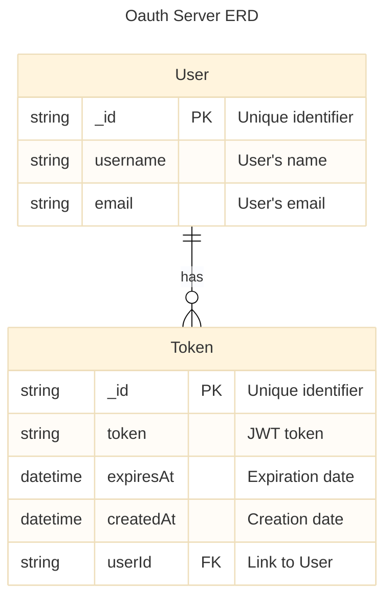
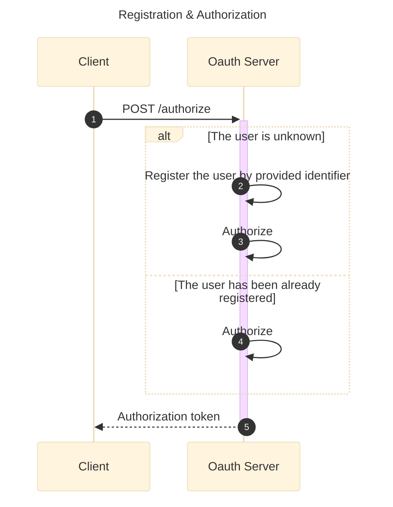

# Oauth Server Specification

## Overview
Standard Oauth 2.0 server according to [RFC 6749](https://datatracker.ietf.org/doc/html/rfc6749).

## Data model

## API Specification
See [RFC 6749](https://datatracker.ietf.org/doc/html/rfc6749)

### Business Logic

#### POST /authorize
