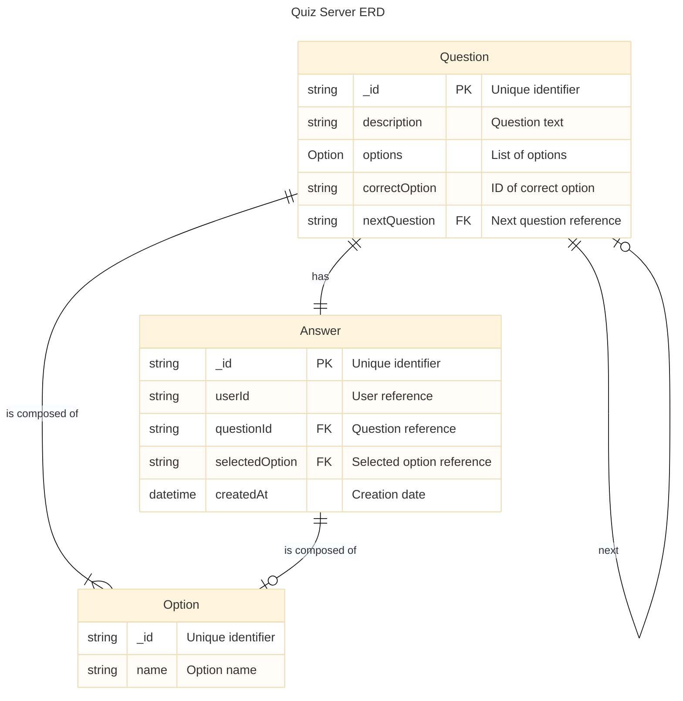
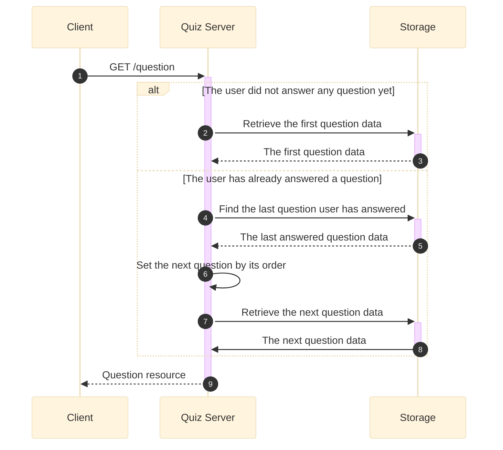
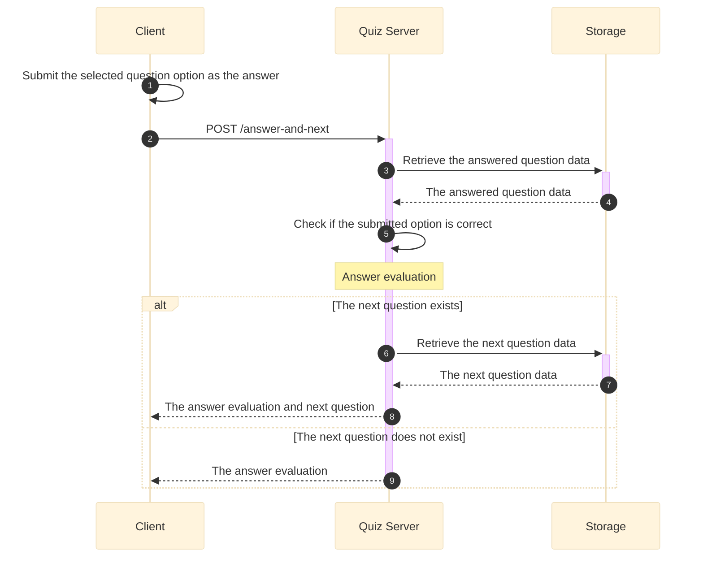
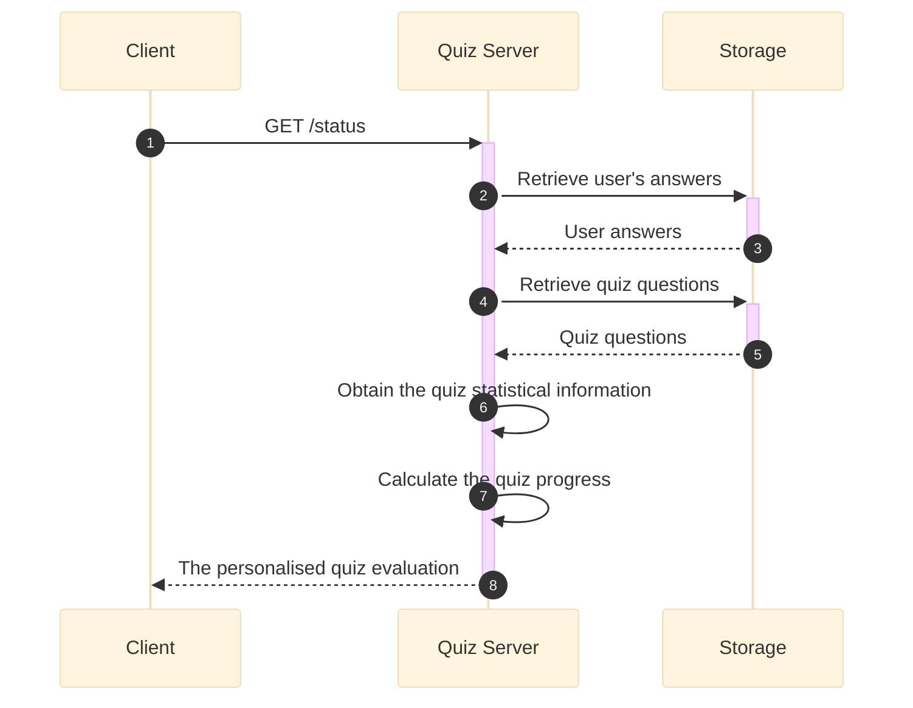

# Quiz Server Specification

## Overview
Quiz Server Microservice that enable users to receive and answer questions.

## Data model

### Inital load
[Questionnaire data - DEMO](assets/questionnaire.yaml)

## API Specification

### Structure
[**Quiz Server OpenAPI specification ⚙️**](quiz_server-openapi.yaml)

### Business Logic

#### GET /question

#### POST /answer-and-next

#### GET /status

#### GET /report
`OUT-OF-SCOPE`
Retrieve current ranking of Quiz contestants. *Not part of the DEMO.*

## Testing
- [Quiz DEMO Smoke Test - Postman Collection](assets/Quiz%20DEMO%20-%20All%20Heads%202024.postman_collection.json)