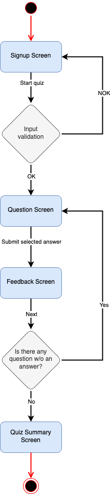
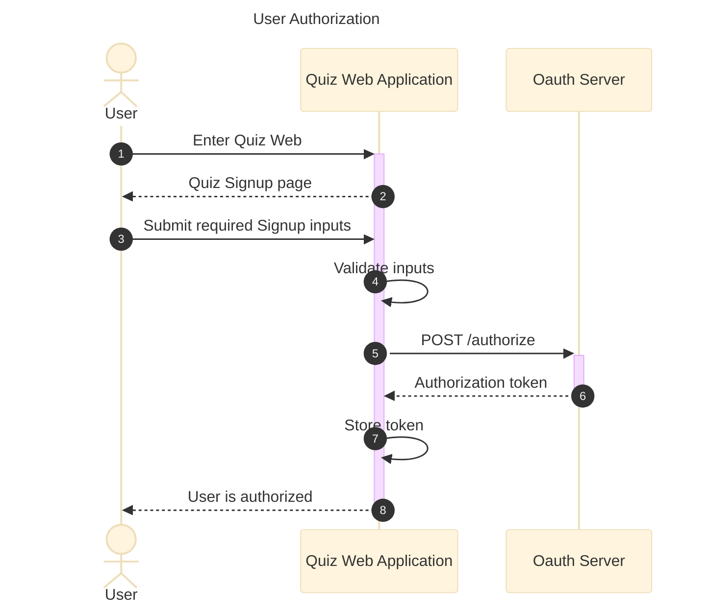
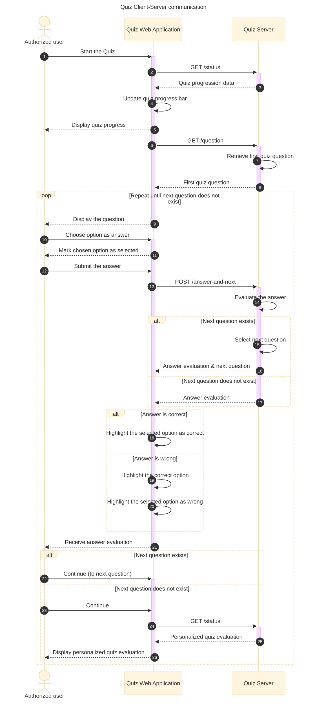

# Quiz Web Application Specification

## Overview
A mobile-first web application that delivers quizzes with immediate feedback and end-of-quiz summary.

Application features design approach focused on usability, interactivity, and responsive design.

- Landing page with user authentication.
- Clean, distraction-free UI, focusing on one question at a time.
- Multiple-choice questions.
- Progress bar and question count (e.g., "Question 5").
- Immediate feedback upon answer submission (correct/incorrect indication).
- Next button to proceed.
- Quiz summary after the last question is answered. 

## Navigational flow

Source: [Navigational Flow diagram](assets/navigation/quiz_web_application_navigation_flow.drawio)

### Authorization
A simple, user-friendly interface allows new users to register or existing users to log in.

#### Design
Capture user information and authenticate against the backend server.

##### SignUp Screen
- Quiz logo with application title as static text.
- Introduction to the quiz app as static text.
- Input fields for user authentication.
- User consent message for use of their data (email). `OUT-OF-SCOPE` *Not part of the DEMO.*
  - The consent is granted by starting the quiz.
- Start button to begin the quiz.

#### Functionality

### The Quiz

#### Designs

##### Question Screen
Displays a question with multiple-choice answers.

- Progress bar and question count (e.g., "Question 5") from BE.
- Question text from BE.
- Multiple-choice input for answer selection from BE.
- Button to submit the selected answer to BE to evaluate and receive feedback.

##### Feedback Screen
Shows the question's correct answer.

- Progress bar and question count (e.g., "Question 5") from BE.
- Question text from BE.
- Multiple-choice input in a read-only form.
  - Highlight the submitted answer.
    - Highlight style differs if the submitted answer was correct or not.
  - Highlight the correct answer.
- Next button to proceed.

##### Quiz Evaluation Screen
Shows the user's quiz results, including score.

- Quiz logo with summary screen title as static text.
- Congratulation message as static text.
- Summary of performance, including the number of correct answers and total questions from BE.
- Computed quiz length from BE.
- Optional message as static text.

#### Functionality
