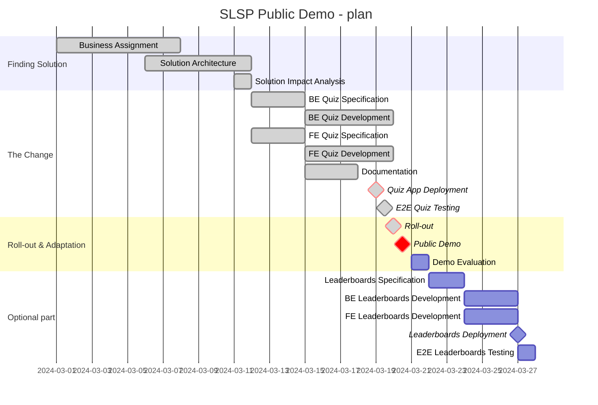

# Analysis

| Meta-data                                        |                 |
| ------------------------------------------------ | --------------- |
| **Specification language**                       | `EN`            |
| **Solution / Application language**              | `SK`            |
| **Contributors** - Business & Analysis           | @Tomáš Gažo     |
| **Contributors** - Architecture & BE Development | @Martin Sárközi |
| **Contributors** - UX Design & FE Development    | @Martin Štefek  |

## Business Assignment
[Business Assignment](1_business_assignment/business_assignment.md)

## Solution Design

### Solution Architecture
[Solution Architecture](2_solution_design/21_solution_architecture/solution_architecture.md)

### Impact Analysis
[Impact Analysis](2_solution_design/22_impact_analysis/impact_analysis.md)

## Infrastructure and Deployment
The application will be deployed on AWS, utilizing services like EC2, RDS, and S3, with a CI/CD pipeline set up for automatic deployment and testing.

## Cloud Infrastructure
`DEMO - OUT-OF-SCOPE`

## Continuous Integration/Continuous Deployment (CI/CD)
`DEMO - OUT-OF-SCOPE`

## Monitoring and Logging
`DEMO - OUT-OF-SCOPE`

## Project Management and Delivery

### Project Plan

## Risk Management
Risk management identifies potential project risks, their impact, and mitigation strategies.

Key risks include technological challenges, delays in development, budget overruns, and lower-than-expected user engagement.

Mitigation strategies involve regular reviews, adopting agile development practices, allocating contingency funds, and implementing a robust marketing strategy to enhance user engagement.

## Quality Assurance Plan
The quality assurance plan ensures that the application meets all functional and non-functional requirements.

It includes comprehensive testing strategies (unit, integration, system, and user acceptance tests), adherence to coding standards, and regular code reviews.

Automated testing and continuous integration tools will be used to maintain high quality and facilitate efficient development cycles.

## Change Management Process
The change management process outlines how changes to the project scope, timelines, or resources will be managed.

It involves evaluating the impact of the change, obtaining necessary approvals, updating project documentation, and communicating changes to all stakeholders.

A change control board will be established to review and approve significant changes.